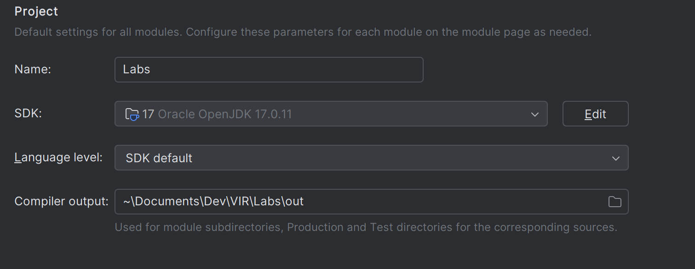
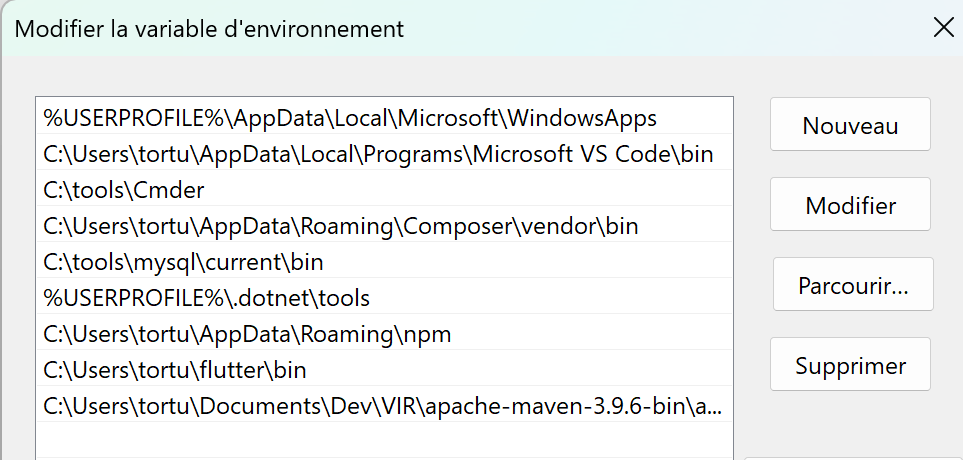

# Labo01 - Environment Setup

* [Labo description](https://cpnv-es-ngy.gitbook.io/vir1/labs/labo01-environment-setup)

## DevOps Stack to setup

Mention in this documentation the orders carried out and the results obtained.

If you have opted for a graphical installation, provide screenshots and describe the procedure up to the result obtained.

### Cloud cmd line interface - AWS Cli

```
msiexec.exe /i https://awscli.amazonaws.com/AWSCLIV2.msi

aws --version
    aws-cli/2.15.40 Python/3.11.8 Windows/10 exe/AMD64 prompt/off
```

### IDE - Intellij

```
Install the exe from this link and use the default settings for the installation : 
    https://www.jetbrains.com/fr-fr/idea/download/?section=windows


Here is the installed intellij version :     
    IntelliJ IDEA 2024.1 (Ultimate Edition)
    Build #IU-241.14494.240, built on March 28, 2024
    For educational use only.
    Runtime version: 17.0.10+8-b1207.12 amd64
    VM: OpenJDK 64-Bit Server VM by JetBrains s r.o.
    Windows 11.0
    GC: G1 Young Generation, G1 Old Generation
    Registry:
        ide.experimental.ui=true
    Non-Bundled Plugins:
        com.intellij.plugins.vscodekeymap (241.14494.150)
        Pythonid (241.14494.314)
        Dart (241.15845)
        com.intellij.lang.jsgraphql (241.14494.150)
        com.jetbrains.php (241.14494.240)
    Kotlin: 241.14494.240-IJ


```

### Containers Engine - Docker

```
Install docker desktop from this link with the default settings : 
    https://www.docker.com/products/docker-desktop/

Docker Desktop 4.29.0 (145265)
Docker Engine v26.0.0
```

### Versioning - Git + Git flow

```
choco install git.install

git --version
git version 2.44.0.windows.1
```

### IDE Plugin - Docker plugin for IntelliJ

```
When you have installed IntelliJ, you can install the Docker plugin by going to the settings and searching for the plugin in the marketplace.

Version: Docker bundled 241.14494.240
```

### Development Kit - JDK

```
Install the JDK from this link :
    https://download.oracle.com/java/17/latest/jdk-17_windows-x64_bin.msi
java -version
    java version "17.0.11" 2024-04-16 LTS
    Java(TM) SE Runtime Environment (build 17.0.11+7-LTS-207)
    Java HotSpot(TM) 64-Bit Server VM (build 17.0.11+7-LTS-207, mixed mode, sharing)
```

### Package manager - Maven

```
Download the binary zip archive from this link :
    https://maven.apache.org/download.cgi
Extract the archive and add the bin folder to the PATH environment variable.
```

```
mvn --version
    Maven home: C:\Users\tortu\Documents\Dev\VIR\apache-maven-3.9.6-bin\apache-maven-3.9.6
    Java version: 17.0.11, vendor: Oracle Corporation, runtime: C:\Program Files\Java\jdk-17
    Default locale: fr_CH, platform encoding: Cp1252
    OS name: "windows 11", version: "10.0", arch: "amd64", family: "windows"
```
## Schema

Show your development environment, mentioning all the components in the stack.

Identify the links between components.


## Analysis

Answer the questions below, giving reasons for your answer (link, source).

### AWS CLI

* How does the AWS Cli interact with the cloud ?

```
it sends the written commands to the aws api to perform actions on cloud services 
```

* What other ways do we have of dialoguing/interacting with the AWS cloud if we wanted to do without the CLI?

```
the graphical interface of aws or the aws SDK
```

* What commands do I need to run in the CLI to start an ec2 instance?

```
aws ec2 run-instances --image-id ami-0c55b159cbfafe1f0 --count 1 --instance-type t2.micro --key-name MyKeyPair
```

### Docker Engine

* What type of hypervisor does Docker use?

```
Docker uses a lightweight hypervisor called MobyLinuxVM
```

* What role does the Docker Desktop play in the Docker architecture?

```
it is the graphical interface of docker that allows you to manage your containers and images
```

### Java Environment

* JDK, JRE, JVM... what's the difference?

```
JDK is the development kit that contains the JVMs. The JRE is the runtime environment that allows you to run java applications. The JVM is the virtual machine that runs the java.
```

### Maven

* What is the command you need to use Maven to retrieve dependencies (and only that)?

```
mvn dependency:resolve
```


